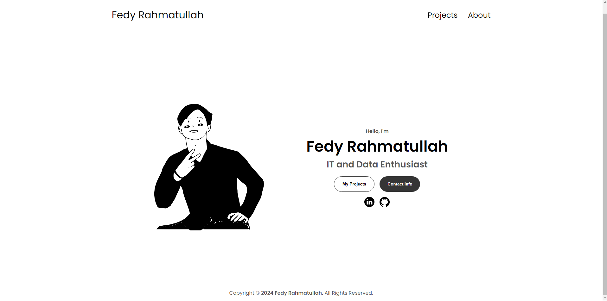

<p align="center">
  <b><h1 align="center">fedyr.com</h1></b>
</p>

<p align="center">
  
</p>

<p align="center">
My first<a href='https://fedyr.com'> personal portfolio website</a>, built with PHP and featuring a "minimal web design" concept.
</p>

## Prerequisites

- Make sure PHP is installed on your system. You can verify the installation by running `php -v` in your terminal.

```bash
php -v
```

## Running locally

```bash
git clone https://github.com/fedyrahmatullah/fedyr.com.git
cd fedyr.com/public
php -S localhost:8000
```

Open [http://localhost:8000](http://localhost:8000) with your browser to see the result.
Note: The "php -S localhost:8000" command is meant for development purposes only and should not be used in a production environment.

## Project Structure

The main content of the website is located in the "public" directory, which is served as the root of the project. Ensure that you navigate to this directory before running the PHP server.

## Troubleshooting

If you encounter issues while running the server, ensure that:

- You are in the correct directory (public).
- No other server is running on port 8000.
- The index.php file exists in the public directory.

## License

Licensed under [MIT License, Copyright (c) 2024 Fedy Rahmatullah](./LICENSE)
